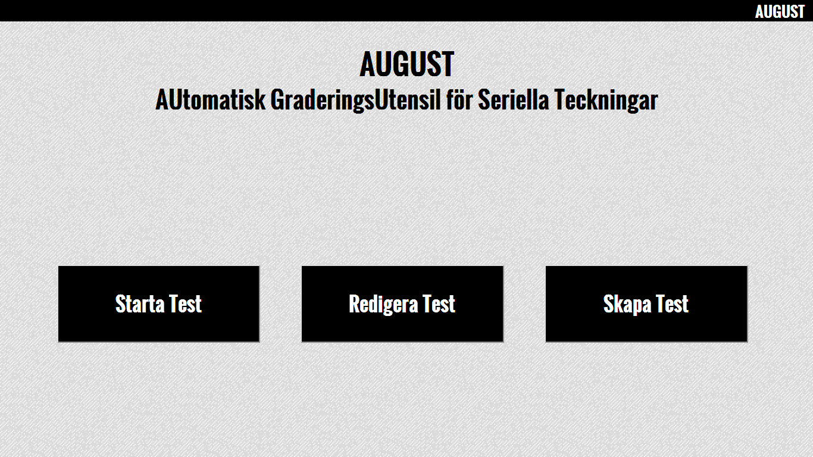
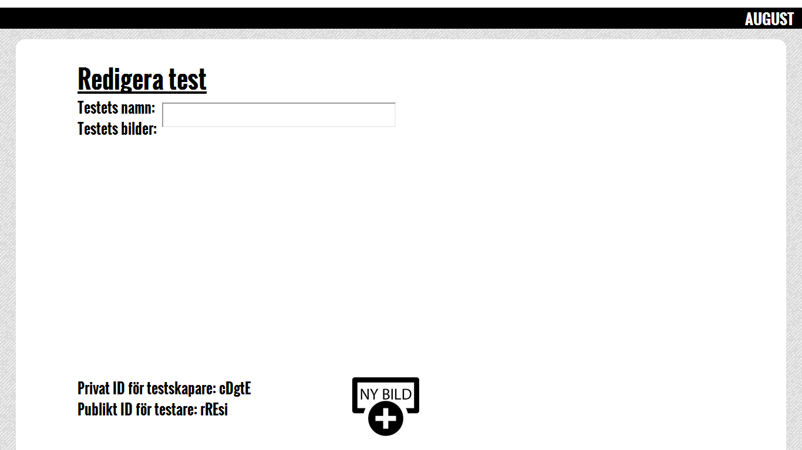

# August

## AUtomatisk GraderingsUtensil för Seriella Teckningar

August är ett system ämnat för lärare och elever på högstadiet.

I AUGUST kommer man att kunna skapa enkla övningar där målet är att lägga ett
antal bilder i rätt ordning genom att dra och släppa dem i rätt boxar.
När man är nöjd kan man välja Rätta och då se vilka bilder som ligger rätt och
vilka som ligger fel. Man kan då flytta om de felaktiga, och välja att rätta igen,
tills ordningen stämmer.

### Kort beskrivning

Man har tre alternativ på main sidan. Du kan skapa ett test, redigera ett befintligt test eller starta ett test. Väljer du att skapa test kommer du in på på http://august.friskola.nu/redigera/"RandomPrivatID". Testet skapar också ett publikt ID. På redigerar sidan kan man lägga upp bilder och sortera dom i den ordning man önskar.
Det privata ID använder du när du ska redigera ditt test och det publika ID används till användare som ska starta testet.
Sidan kan används helt utan inloggning, vilket passar bra för en skola där elever och lärare glömmer bort sina inloggnings
-uppgifter hela tiden.

####Så här ser det ut när du kommer in på sidan:

####Skapa test och redigera test sidan:

####Så här ser det ut när man har laddat upp några bilder:

Man byter plats på bilderna när man trycker på pilarna och tar bort bilder när man använder papperskorgen.

### Teknisk beskrivning

I www katalogen ligger allt som visas på nätet. I www katalogen ligger endast filer som behövs visas och det ger högre säkerhet att ha så lite som möjligt som servas på nätet. I www ligger själva designen på hemsidan stilar, bilder och skript. Men också index.php och .htaccess.

Application det som styr hemsidan, själva intelligensen. Här ligger alla vyer, controllers och vår databas. Systemet bygger på Model-View-Controller(MVC) designmönstret där modellen och vyn ligger i separata kataloger så att inte datahanteringen blir påverkad av förändringar i presentationslagret och tvärtom. Mellan dem ligger controller komponenten som gör det möjligt.

Routern består av två filer: .htaccess och Index.php, det är där besökarna hamnar först.

#### Routern: .htaccess och index.php

Routern bygger på Apache. Det börjar med att .htaccess hämtar query-strängen och skickar den vidare till index.php. Sedan läser index.php av strängen och skickar dig vidare till en passande controller som leder en vidare till rätt sida eller en feldokumentsida(404 error page) om queryn inte matchar någon tillåten väg.

index.php redirectar dig till de olika vyerna beroende på vad du skriver i URL:n.

#### Controllers

I application/controllers ligger alla controllers där finns alla filer som används för att kalla på lämpliga funktioner från modellen samt att hämta den data som behövs för att kunna rendera en vy. Så till exempel om en användare ska kolla på ett test så är det en controller som hämtar hela testet.

#### Model

Modellen består endast av en php-fil som liiger i application/model, den filen utgör ett inteface mot en DB4-databas.
Vi använder databasen "the Berkeley Database"(DB4). Som erbjuder den inbyggda databasen stöd för både traditionella och klient/server-applikationer. 

En av de stora fördelarna med att dela upp kod på detta sätt är att man lätt skulle kunna byta ut databasmotorn till något annat, till exempel MySQL genom att endast ändra i php-filen.
##### DB4

För att systemet ska fungera så behövs DB4 bli angett i PHP och så behövs rätt rättigheter i den katalog där databasen ska ligga.

#### Views

I application/views ligger alla vy-filer som består av framförallt html samt lite php, men även JavaScript om den behövs och kan vara dynamisk. CSS och icke-dynamisk JavaScript ligger i www-katalogen men de hjälper också till med att bygga upp vyn. 

Alla vyer har en gemensam header som gör att alla vyer är uppbyggda på samma sätt med meta-taggar, länkar till CSS, Favicon, och typsnitt.

#### Uppladdade bilder

För att man ska kunna ladda upp bilder så behövs en uploads mapp med rätt rättigheter för att kunna ladda upp bilder dit från redigera vyn. Där mappar skapas efter vilket test det är man redigerar.
* Vad måste man göra för att få uppladdning av bilder att fungera?

