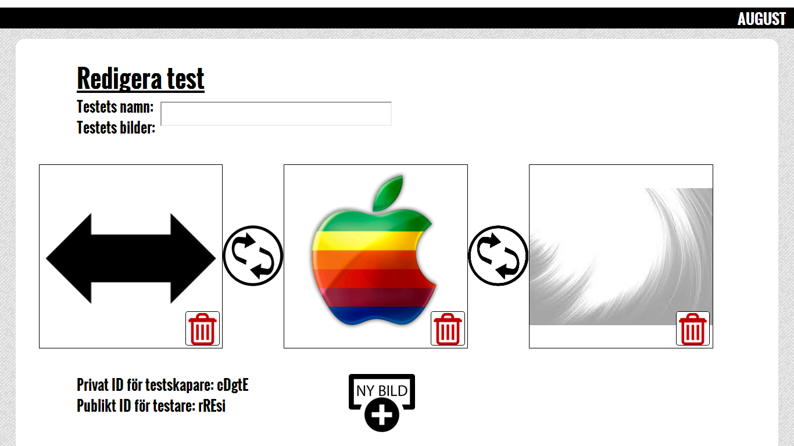

# August

## AUtomatisk GraderingsUtensil för Seriella Teckningar

August är ett system ämnat för lärare och elever på högstadiet.

I AUGUST kommer man att kunna skapa enkla övningar där målet är att lägga ett
antal bilder i rätt ordning genom att dra och släppa dem i rätt boxar.
När man är nöjd kan man välja Rätta och då se vilka bilder som ligger rätt och
vilka som ligger fel. Man kan då flytta om de felaktiga, och välja att rätta igen,
tills ordningen stämmer.

### Kort beskrivning

* Bra att nämna att hela systemet är inloggningsfritt, vilket är skönt i en skola där alla elever glömmer sina inloggningsuppgifter hela tiden

Man har tre alternativ på main sidan. Du kan skapa ett test, redigera ett befintligt test eller starta ett test. Väljer du att skapa test kommer du in på på http://august.friskola.nu/redigera/"RandomPrivatID". Testet skapar också ett publikt ID. På redigerar sidan kan man lägga upp bilder och sortera dom i den ordning man önskar.
Det privata ID använder du när du ska redigera ditt test och det publika ID används till användare som ska starta testet.

Så här ser det ut när du kommer in på sidan:

Så här ser sidan ut där man skapar och redigerar sitt test:

Så här ser det ut när man har laddat upp några bilder:

Man byter plats på bilderna när man trycker på pilarna och tar bort bilder när man använder papperskorgen.

### Teknisk beskrivning

I www katalogen ligger allt som servas på nätet. Vi har inte så många filer i www katalogen eftersom det är högre säkerhet att ha så lites om möjligt som servas på nätet. I www ligger själva designen på hemsidan styles, images och scripts. Men också index.php och .htaccess.

Application det som styr hemsidan själva intelligensen. Här ligger alla vyer, controllers och vår databas.

* systemet bygger på MVC
* Routern utgörs av två filer: .htaccess och index.php, där hamnar besökare först

#### Routern: .htaccess och index.php

* bygger på Apache
* .htaccess hämtar query-strängen och skickar den till index.php
* index.php skickar användaren till en lämplig controller, kanske till felsidan

Vår .htacces redirectar dig till index.php eller anpassad feldokumentsida (404 error page).

index.php redirectar dig till de olika vyerna beroende på vad du skriver i URL:n.

#### Controllers

* I application/controllers ligger alla controllers
* De är ansvariga för att kalla på lämpliga funktioner från modellen, och hämta den data som behövs för att sedan rendera en vy. Typ om en användare ska kolla på ett test, så måste den kontrollern hämta hela testet.

#### Model

* Modellen består av en php-fil, som ligger i application/model
* den php-filen utgör ett interface mot en DB4-databas, skulle man i framtiden vilja byta databasmotor till exempelvis MySQL, så är det endast i den php-filen man behöver ändra något. Det är en av de stora stora fördelarna med att dela upp kod på detta sätt.

Vi använder databasen "the Berkeley Database" (DB4). Som erbjuder en inbyggda databasen stöd för både traditionella och klient / server-applikationer. 

##### DB4

* för att få systemet att fungera måste man ha DB4 enablat i PHP, samt ha rätt rättigheter i den katalog där databasen ska ligga.

#### Views

* I denna katalog ligger alla vy-filer. Oftast innehåller de endast html med lite php-kryddning, men ibland måste de även innehålla en del JavaScript (om det är så att Javascripten kan vara dynamisk). CSS och icke-dynamisk JavaScript ligger i www-katalogen, men de tillhör egentligen också vyn.

#### Uppladdade bilder

* Vad måste man göra för att få uppladdning av bilder att fungera?

